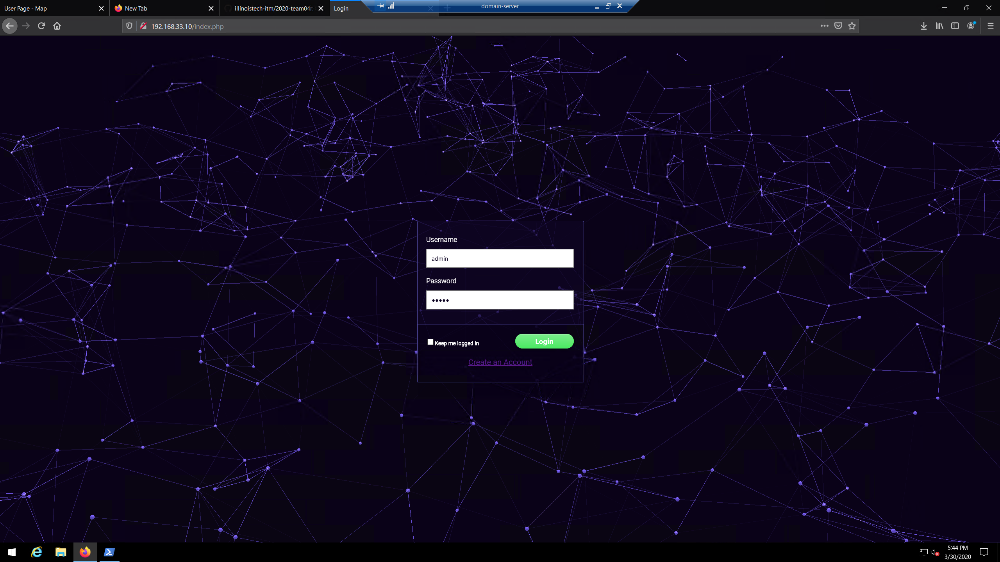
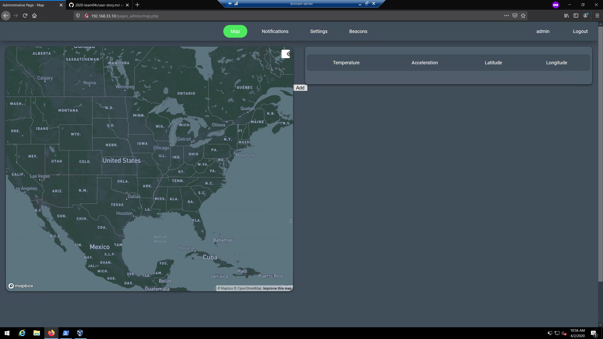
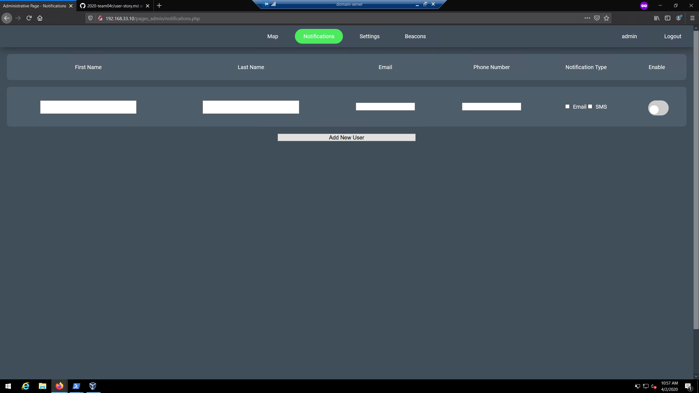
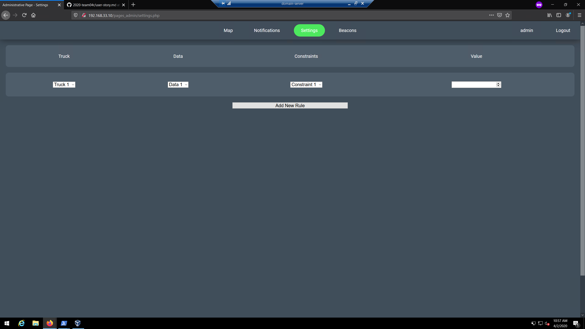
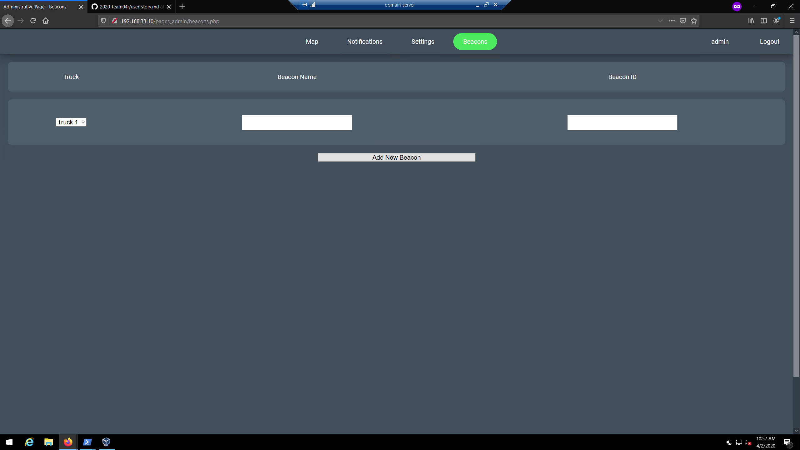

### Admin Story
* The ONLY admins are internal employees who add beacons after purchase of the web application fees and beacon costs
* Once admins sign in they can view the following dashboard items
    * Map
    * Notifications
    * Settings
    * Beacons
    * This is where we can add their organization beacons via beacon ID to link such to their account for tracking purposes

