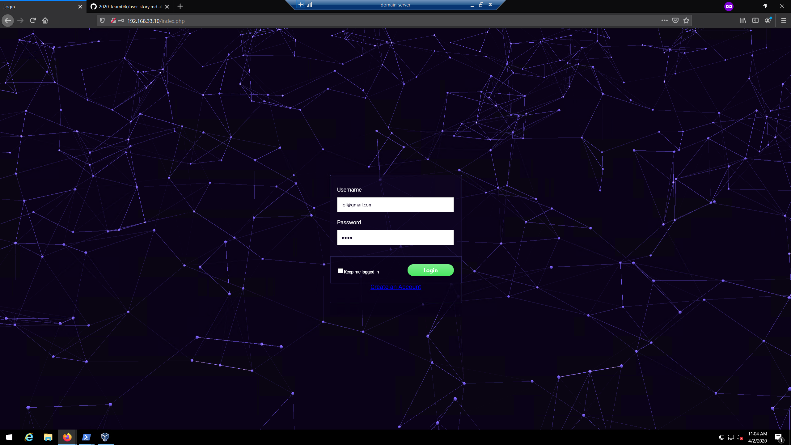
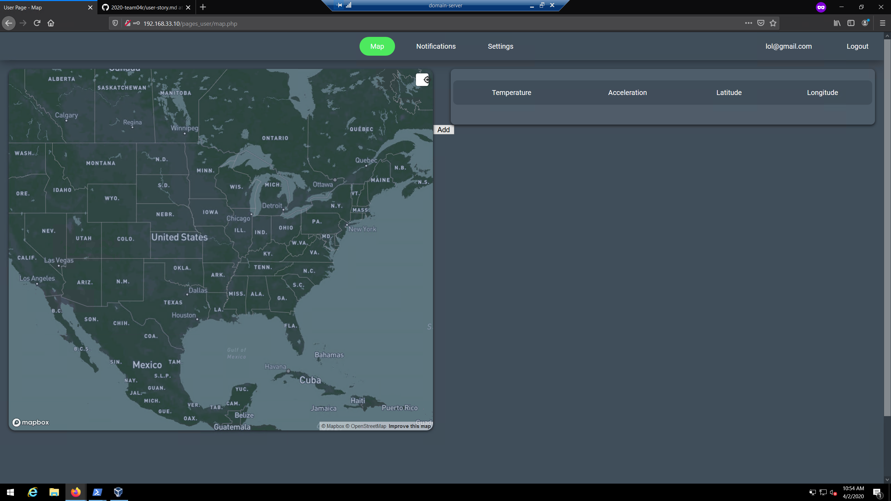
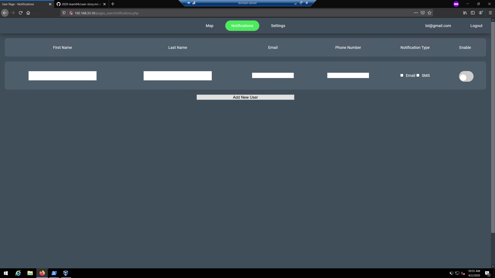
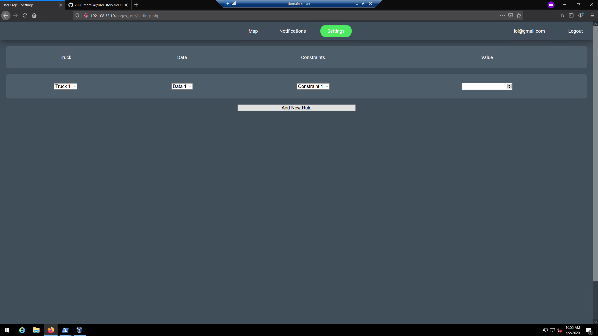
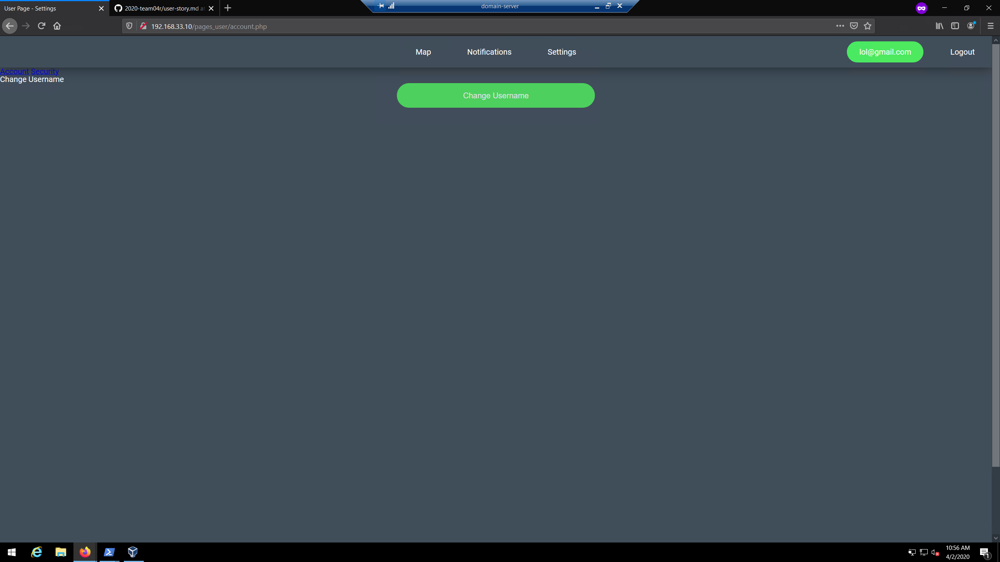

## User/Admin/Anonymous Story

## User Story
* Users of the web application include logistical tracking company employees, grocery store owners, distribution center employees
* We do NOT allow users to view the "Beacons" screen since this is where we can add the beacons they have purchased into their organization dashboard
* Once users sign in they can view the following dashboard items
    * Map
    * Notifications
    * Settings
    * Change Username

