# Sprint-02 Report

## Team Number 04

* Jacob Krupa, Project Manager
    
* Geldi Omeri, Developer
    
* John Collins, Infrastructure and IT
    
* Robert Bacius, UI/UX Designer
    
* Andy Kukuc, Jr. Developer
    
## Project Manager Report

* As project manager, I was responsible for keeping the team on track and organized during sprint #2
    * My main goals reflect supporting the team and making sure I could help where help was needed
    * I prepared this report for sprint #2 and helped set the goals and vision for sprint #3
    * I also created and developed the install.md for the installation of some of the parts of our project
    * Managed and communicated to the team to keep everything organized and flowing

* Project Manager
    * Prepare Sprint #2 report - Completed
        * https://github.com/illinoistech-itm/2020-team04r/commit/df8a4f56ae6719e69b1ab753267aa9e11d9a8088
        * https://trello.com/c/4VYptCGB/22-prepare-sprint-2-report
    * Set the teams Sprint #3 Goals - Completed
        * https://github.com/illinoistech-itm/2020-team04r/commit/3475d3f086ff946a3d32a460e5c296db6ce6e399
        * https://trello.com/c/r7T7H6Ng/28-set-the-teams-sprint-3-goals
    * Log team tasks in Trello to hold accountability per team member - Completed
        * Git artifact doesn't exist due the task not being something I could put on git
        * https://trello.com/c/p1KYiQ1c/30-log-team-tasks-in-trello-to-hold-accountability-per-team-member-for-sprint-2
    * Managed and communicated to team members to keep progress and development moving for sprint #2 - Completed
        * Git artifact doesn't exist due the task not being something I could put on git
        * https://trello.com/c/2vbZ4GZX/29-receive-and-administer-tasks-per-team-member-for-sprint-2
    * Create and push Install.md into the repository - Completed
        * https://github.com/illinoistech-itm/2020-team04r/commit/ee9fc3823fdb6052bd114fa268766a9423a04df5
        * https://trello.com/c/N6Zw3n7s/27-installmd-file-for-other-users-to-rebuild

* UI/UX
    * Finish the web application wireframes - Completed
        * https://github.com/illinoistech-itm/2020-team04r/commit/cbb774850cdbd7a4c4325fc7abe60d6361aada0a
        * https://trello.com/c/9rugGnBd/31-finish-final-web-application-wire-frames
    * Finish complete final web application screens - Completed
        * https://github.com/illinoistech-itm/2020-team04r/commit/36e6501da59d145c15e418f8193b8bcc5821f58
        * https://trello.com/c/pr18RWbZ/26-phase-2-of-front-end-development-polished-screens
    * Finish interactive prototype with final screens - Completed
        * https://github.com/illinoistech-itm/2020-team04r/commit/36e6501da59d145c15e418f8193b8bcc5821f588
        * https://trello.com/c/onaV42p2/45-finish-interactive-prototype-with-final-screens
    * Organize previous user stories for account managers for account managers(Admins) and users into one document - Completed
        * https://github.com/illinoistech-itm/2020-team04r/commit/46aa99fee8ea6c6b9293d508e869462ecd480ce8
        * https://trello.com/c/5z0cHNtN/32-organize-previous-user-stories-for-account-managers-for-account-managersadmins-and-users-into-one-document
    * Help modify login page to match up to the Vanata.js animation - Completed
        * https://github.com/illinoistech-itm/2020-team04r/commit/ec107e9fbe4b4a850ba441ade7a181ccf1e93c7b
        * https://trello.com/c/91GdkmnN/33-modified-login-page-to-match-up-to-the-vanatajs-animation
    * Help code json file to send beacon GPS data info to the cloud API - Completed
        * https://github.com/illinoistech-itm/2020-team04r/commit/bd46d1f5ee67007da2e4c4495dc8258fca650bd7
        * https://trello.com/c/BPDTntK8/36-code-json-file-to-send-beacon-gps-data-info-to-the-cloud-api

* Developer
    * Create and set up map table to be filled in with data - Completed
        * https://github.com/illinoistech-itm/2020-team04r/commit/91c405f03becc608ba7cf9f26e18646b48e39b4c
        * https://trello.com/c/UONrpyie/40-create-and-set-up-map-table-to-be-filled-in-with-data
    * Create and apply JavaScript in notification pages to make the inputs and buttons functional - Completed
        * https://github.com/illinoistech-itm/2020-team04r/commit/97ca90ec672d1ca3ccd41bf103c2f84802d55b93
        * https://trello.com/c/mCHK7Y3S/41-create-and-apply-javascript-in-notification-pages-to-make-the-inputs-and-buttons-functional
    * Create and apply JavaScript in settings page to make the inputs and buttons functional - Completed
        * https://github.com/illinoistech-itm/2020-team04r/commit/97ca90ec672d1ca3ccd41bf103c2f84802d55b93
        * https://trello.com/c/I8LbV7Lx/42-create-and-apply-javascript-in-settings-page-to-make-the-inputs-and-buttons-functional
    * Create and apply JavaScript in beacons page to make the inputs and buttons functional - Completed
        * https://github.com/illinoistech-itm/2020-team04r/commit/97ca90ec672d1ca3ccd41bf103c2f84802d55b93
        * https://trello.com/c/0cvW1fKf/43-create-and-apply-javascript-in-beacons-page-to-make-the-inputs-and-buttons-functional
    * Decide how the beacon data would be pushed to the web application - Completed
        * https://github.com/illinoistech-itm/2020-team04r/commit/9654610f7cb1ae1004c53cd000b67a8324127a0c
        * https://trello.com/c/fsCxyR5w/44-decide-on-how-the-beacon-data-would-be-collected-and-pushed-to-the-web-application
    * Modify login page to match up to the Vanata.js animation - Completed
        * https://github.com/illinoistech-itm/2020-team04r/commit/ec107e9fbe4b4a850ba441ade7a181ccf1e93c7b
        * https://trello.com/c/91GdkmnN/33-modified-login-page-to-match-up-to-the-vanatajs-animation

* IT Infastructure
    * Set up physical server to allow for real-time use and testing of our project - Completed
        * Git artifact doesn't exist due to the physical nature of the task
        * https://trello.com/c/Wbde42e6/37-set-up-physical-server-to-allow-for-real-time-use-and-testing-of-our-project
    * Set up Ubuntu 18.04 on the physical server - Completed
        * Git artifact doesn't exist due to the physical nature of the task
        * https://trello.com/c/TEp8LlQz/38-set-up-ubuntu-1804-on-the-physical-server
    * Install SSD on the physical server for better I/O operations - Completed
        * Git artifact doesn't exist due to the physical nature of the task
        * https://trello.com/c/9zGGwR7G/39-install-ssd-on-the-physical-server-for-better-i-o-operations
    * Receive and activate LTE/bluetooth beacons - Completed
        * Git artifact doesn't exist due to the physical nature of the task
        * https://trello.com/c/TnuBUDYW/8-receive-and-activate-lte-beacons
    * Configure physical server for remote access from every team member
        * Git artifact doesn't exist due to the set up being on physical server
        * https://trello.com/c/9tbu26Ny/47-configure-physical-server-for-remote-access
    * Research of choice of data storage - Completed
        * Git artifact doesn't exist due being more research-based decision
        * https://trello.com/c/0HShi71c/48-research-choice-of-data-storage
    * Create Database Schema - Completed
        * https://github.com/illinoistech-itm/2020-team04r/commit/9988b20e03acf212fd234479190f57a083f46caa
        * https://trello.com/c/P6ZrEFay/6-create-database-schema

* Junior Developer
    * Set up Estimote API endpoint that corresponds with micro app and sent to developers - Completed
        * Git artifact doesn't exist due to the endpoint setup residing to a cloud platform
        * https://trello.com/c/iwbRHveN/18-set-up-estimote-api-endpoint-that-corresponds-with-micro-app-and-sent-to-developers
    * Code json file to send beacon temperature data info to the cloud API - Completed
        * https://github.com/illinoistech-itm/2020-team04r/commit/5ab05c700746b9043cba778f772ee4abdabb1da8
        * https://trello.com/c/w4FvSejF/34-code-json-file-to-send-beacon-temperature-data-info-to-send-to-cloud-api
    * Code json file to ask for data information to send to the cloud API with the proper configuration for our timezone based on a set time configuration
        * https://github.com/illinoistech-itm/2020-team04r/commit/9654610f7cb1ae1004c53cd000b67a8324127a0c
        * https://trello.com/c/kvLm0OJB/35-code-json-file-to-ask-for-data-info-to-send-to-cloud-api-with-the-proper-configuration-for-our-timezone-based-on-a-set-time-conf
    * Code json file to send beacon GPS data info to the cloud API - Completed
        * https://github.com/illinoistech-itm/2020-team04r/commit/bd46d1f5ee67007da2e4c4495dc8258fca650bd7
        * https://trello.com/c/BPDTntK8/36-code-json-file-to-send-beacon-gps-data-info-to-the-cloud-api
    * Research how to create a self-signed certificate for physical test server - Completed
        * https://github.com/illinoistech-itm/2020-team04r/commit/e7de12efd5abddf37654cb5c87c3c11da2bd6d91
        * https://trello.com/c/6kionJO5/46-research-how-to-create-a-self-signed-certificate-for-physical-test-server

* User Story Left Outstanding
    * Many aspects of the project are still not addressed yet
    * Much of the back-end and front-end require work to get them to the level required for the project to be completed
    * Scripting the project with vagrant/packer is going to take time and will need to be focused on as the project progresses
    * Security assumptions and tasks will also need to be addressed for the both the project and the user's security/privacy
    * However, there is much time to work on these tasks and complete the project by the end of the semester
    
## Atomic Goals for Sprint-03

List atomic goals here in ordered list, minimum 5 per category

* Project Manager
    * Prepare Sprint #3 report
    * Set the teams Sprint #4 Goals
    * Log team tasks in Trello to hold accountability per team member
    * Receive and administer tasks per team member
    * Update Install.md into the repository for further instructions

* UI/UX
    * Find icons for polished screens
    * Update and match web application CSS to match final screens
    * Develop another UX for notification creation logic. We need another way users can choose when to receive notifications via SMS and Email. Possibly onboarding email/SMS messages to our platform.
    * Develop SMS/Email content when notifications are received 
    * Build email wireframe for when notifications are received through email

* Developer
    * Create and develop javascript to periodically update map table with newest beacon data
    * Use Node.JS to grab data from database
    * Use Node.JS to update website with database data
    * Use Node.JS to grab user inputted data from the website
    * Use Node.JS to push data inputted from the website into the database

* IT Infastructure
    * Create database and database schema based on previously created entity-diagram chart 
    * Create test database based with at least 15 test users
    * Script creation of database and test users with vagrant and packer
    * Research and script master-slave replication for database
    * Create and develop a data flow diagram for entire data flow of database, web application, and cloud API

* Junior Developer
    * Develop and implement back-end prototype on the physical server itself
    * Purchase a domain for public access to our server
    * Setup login authentication for users
    * Connect beacons and code them to show up on Mapbox API
    * Finalize fetch for front end and start collecting true data

## UI/UX Report

Based on the intial user/admin story, we sought out to design UI and the website based around the functionality and the aesthetics we felt would benefit the user while allowing for admin to function as well.
* Based on the inital user/admin story along with the inital wireframes, we finalized our wireframes to reflect the user functionality. These wireframes contained the different views:
    * Map
    * Notifications
    * Settings
    * Beacons
* Based on the finalized wireframes, we created polished web applications screens that progressed toward and built upon those wireframes and supported that user/admin story
    * Once that screens were completed, an interactive prototype was worked on to show how the user would be able to use the front-end web site before actually committing any code.
    * These final screens/interactive prototype can be seen at the bottom of the report in the user/admin story
* Along with this, the UI/UX role organized the previous user story into one organized document for sprint #2 based on sprint #1 feedback
* While the UI/UX role was focused on UI/UX, they also helped both the developer and junior developer with back-end development such as GPS and implementing front-end UI work such as with the Vanta.js animation

* UI/UX Goals
    * Finish the web application wireframes - Completed
        * https://github.com/illinoistech-itm/2020-team04r/commit/cbb774850cdbd7a4c4325fc7abe60d6361aada0a
        * https://trello.com/c/9rugGnBd/31-finish-final-web-application-wire-frames
    * Finish complete final web application screens - Completed
        * https://github.com/illinoistech-itm/2020-team04r/commit/36e6501da59d145c15e418f8193b8bcc5821f58
        * https://trello.com/c/pr18RWbZ/26-phase-2-of-front-end-development-polished-screens
    * Finish interactive prototype with final screens - Completed
        * https://github.com/illinoistech-itm/2020-team04r/commit/36e6501da59d145c15e418f8193b8bcc5821f588
        * https://trello.com/c/onaV42p2/45-finish-interactive-prototype-with-final-screens
    * Organize previous user stories for account managers for account managers(Admins) and users into one document - Completed
        * https://github.com/illinoistech-itm/2020-team04r/commit/46aa99fee8ea6c6b9293d508e869462ecd480ce8
        * https://trello.com/c/5z0cHNtN/32-organize-previous-user-stories-for-account-managers-for-account-managersadmins-and-users-into-one-document
    * Help modify login page to match up to the Vanata.js animation - Completed
        * https://github.com/illinoistech-itm/2020-team04r/commit/ec107e9fbe4b4a850ba441ade7a181ccf1e93c7b
        * https://trello.com/c/91GdkmnN/33-modified-login-page-to-match-up-to-the-vanatajs-animation
    * Help code json file to send beacon GPS data info to the cloud API - Completed
        * https://github.com/illinoistech-itm/2020-team04r/commit/bd46d1f5ee67007da2e4c4495dc8258fca650bd7
        * https://trello.com/c/BPDTntK8/36-code-json-file-to-send-beacon-gps-data-info-to-the-cloud-api

## Developer Report

Based on the intial user/admin story and the UI/UX designs and prototypes, we sought out to develop and implement the HTML, CSS, and javascript that would ultimately support our front-end website
* For this sprint, our developer was mainly focused on the front end website. We thought it to be important to develop the front-end with design aspect of our inital user/admin story and implement the functionality as based on those requirements
* The developer focused on implementing the tables and areas where data would be viewed and stored on the website. We felt like this was important to focus early on as this is what the user would see whenever they used our website
* These pages were developed in sprint #2 to provide functionality and the ability to see the data that our users would want to see
    * Map
    * Notifications
    * Settings
    * Beacons
* Along with this, the developer researched, messed around with, and decided how we would be gathering our data from our beacons
    * Currently, we are using the Fetch API to grab our data before we parse it for the information we need, however we will need to use Node.js for data input, retrival, and etc.

* Developer Goals
    * Create and set up map table to be filled in with data - Completed
        * https://github.com/illinoistech-itm/2020-team04r/commit/91c405f03becc608ba7cf9f26e18646b48e39b4c
        * https://trello.com/c/UONrpyie/40-create-and-set-up-map-table-to-be-filled-in-with-data
    * Create and apply JavaScript in notification pages to make the inputs and buttons functional - Completed
        * https://github.com/illinoistech-itm/2020-team04r/commit/97ca90ec672d1ca3ccd41bf103c2f84802d55b93
        * https://trello.com/c/mCHK7Y3S/41-create-and-apply-javascript-in-notification-pages-to-make-the-inputs-and-buttons-functional
    * Create and apply JavaScript in settings page to make the inputs and buttons functional - Completed
        * https://github.com/illinoistech-itm/2020-team04r/commit/97ca90ec672d1ca3ccd41bf103c2f84802d55b93
        * https://trello.com/c/I8LbV7Lx/42-create-and-apply-javascript-in-settings-page-to-make-the-inputs-and-buttons-functional
    * Create and apply JavaScript in beacons page to make the inputs and buttons functional - Completed
        * https://github.com/illinoistech-itm/2020-team04r/commit/97ca90ec672d1ca3ccd41bf103c2f84802d55b93
        * https://trello.com/c/0cvW1fKf/43-create-and-apply-javascript-in-beacons-page-to-make-the-inputs-and-buttons-functional
    * Decide how the beacon data would be pushed to the web application - Completed
        * https://github.com/illinoistech-itm/2020-team04r/commit/9654610f7cb1ae1004c53cd000b67a8324127a0c
        * https://trello.com/c/fsCxyR5w/44-decide-on-how-the-beacon-data-would-be-collected-and-pushed-to-the-web-application
    * Modify login page to match up to the Vanata.js animation - Completed
        * https://github.com/illinoistech-itm/2020-team04r/commit/ec107e9fbe4b4a850ba441ade7a181ccf1e93c7b
        * https://trello.com/c/91GdkmnN/33-modified-login-page-to-match-up-to-the-vanatajs-animation

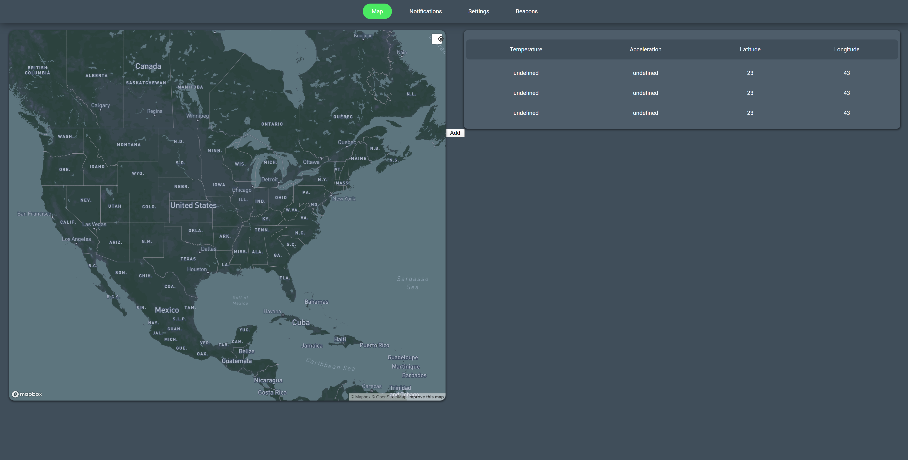
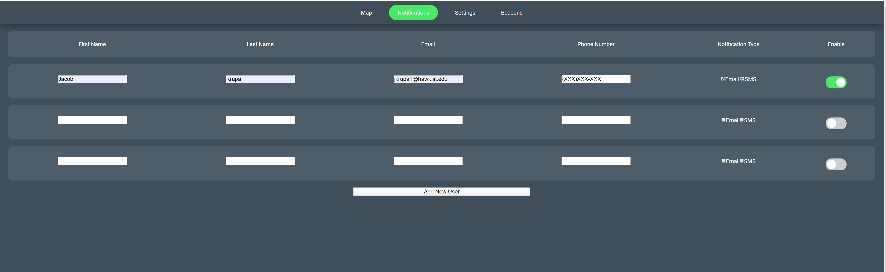
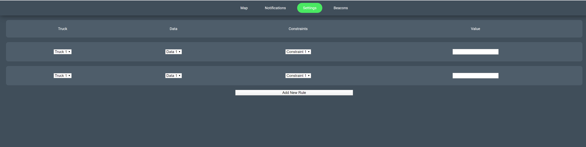
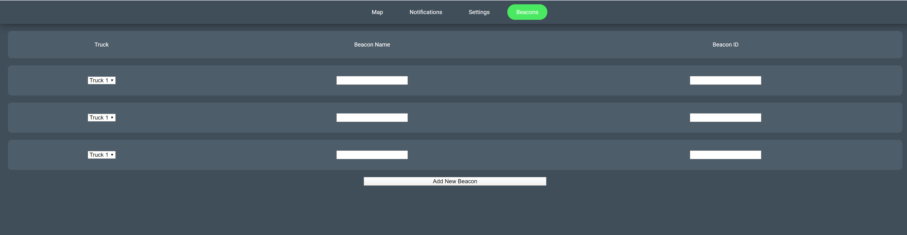

## IT Infrastructure Report

Based on the intial user/admin story, we needed to create and develope a back-end to support everything we wanted to do for the project
* We first received our beacons in the mail and configured and activated them for use in our project
* In the first sprint, we developed a vagrant/packer script to simulate how the back-end should look and function initially
    * With this sprint, we focused more on physical server creation to allow us to develop our back-end and see what we need to add before we put it into our vagrant/packer script
* With this in mind, our IT infastructure role got and set up a physical server that would allow us to all use and develop our back-end on
    * This machine was set-up with Linux in mind, specifically Ubuntu
* We also upgraded the machine with parts such as an SSD to improve its performance for our back-end development
* Along with this, the IT role also focused on getting the server running for all of us to use
    * We also focused on the type of data storage we would want for our back-end, which will be MySQL server
    * However, a database schema on how the data should be stored is complete

* IT Infastructure Goals
    * Set up physical server to allow for real-time use and testing of our project - Completed
        * Git artifact doesn't exist due to the physical nature of the task
        * https://trello.com/c/Wbde42e6/37-set-up-physical-server-to-allow-for-real-time-use-and-testing-of-our-project
    * Set up Ubuntu 18.04 on the physical server
        * Git artifact doesn't exist due to the physical nature of the task - Completed
        * https://trello.com/c/TEp8LlQz/38-set-up-ubuntu-1804-on-the-physical-server
    * Install SSD on the physical server for better I/O operations
        * Git artifact doesn't exist due to the physical nature of the task - Completed
        * https://trello.com/c/9zGGwR7G/39-install-ssd-on-the-physical-server-for-better-i-o-operations
    * Receive and activate LTE/bluetooth beacons - Completed
        * Git artifact doesn't exist due to the physical nature of the task
        * https://trello.com/c/TnuBUDYW/8-receive-and-activate-lte-beacons
    * Configure physical server for remote access from every team member
        * Git artifact doesn't exist due to the set up being on physical server
        * https://trello.com/c/9tbu26Ny/47-configure-physical-server-for-remote-access
    * Research of choice of data storage - Completed
        * Git artifact doesn't exist due being more research-based decision
        * https://trello.com/c/0HShi71c/48-research-choice-of-data-storage
    * Create Database Schema - Completed
        * https://github.com/illinoistech-itm/2020-team04r/commit/9988b20e03acf212fd234479190f57a083f46caa
        * https://trello.com/c/P6ZrEFay/6-create-database-schema

## Junior Developer and Security Assumptions

Based on the intial user/admin story and the UI/UX designs and prototypes and initial front-end, we sought out to develop the flow of data to our front-end and back-end from the beacons and cloud API
* One of the first things we did is set up the endpoint for Estimote API, so that we can connect and use our beacons with cloud API
* For this sprint, our junior developer was mainly focused on the data collection and flow that we would need for us to collect the data we need
* So, the junior developer worked on being able to grab and collect and view the data that was being sent by our beacon
* This includes gathering many pieces of data, but the most important ones that we focused on was temperature and GPS coordinates as these are important pieces for our project
* We based how the data will be sent on a 5 minute interval for now as we test and develop this project but this may change in the future
* Finally, we researched how to set up and how we would set up the self-signed HTTPS certificate when we got to the point of needing it

* Junior Developer Goals
    * Set up Estimote API endpoint that corresponds with micro app and sent to developers - Completed
        * Git artifact doesn't exist due to the endpoint setup residing to a cloud platform
        * https://trello.com/c/iwbRHveN/18-set-up-estimote-api-endpoint-that-corresponds-with-micro-app-and-sent-to-developers
    * Code js file to send beacon temperature data info to the cloud API - Completed
        * https://github.com/illinoistech-itm/2020-team04r/commit/5ab05c700746b9043cba778f772ee4abdabb1da8
        * https://trello.com/c/w4FvSejF/34-code-json-file-to-send-beacon-temperature-data-info-to-send-to-cloud-api
    * Code js file to ask for data information to send to the cloud API with the proper configuration for our timezone based on a set time configuration
        * https://github.com/illinoistech-itm/2020-team04r/commit/9654610f7cb1ae1004c53cd000b67a8324127a0c - Completed
        * https://trello.com/c/kvLm0OJB/35-code-json-file-to-ask-for-data-info-to-send-to-cloud-api-with-the-proper-configuration-for-our-timezone-based-on-a-set-time-conf
    * Code js file to send beacon GPS data info to the cloud API - Completed
        * https://github.com/illinoistech-itm/2020-team04r/commit/bd46d1f5ee67007da2e4c4495dc8258fca650bd7
        * https://trello.com/c/BPDTntK8/36-code-json-file-to-send-beacon-gps-data-info-to-the-cloud-api
    * Research how to create a self-signed certificate for physical test server - Completed
        * git artifact doesn't exist due to research nature of the task
        * https://trello.com/c/6kionJO5/46-research-how-to-create-a-self-signed-certificate-for-physical-test-server

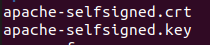
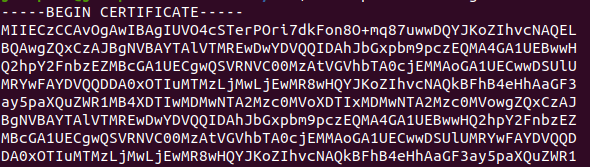

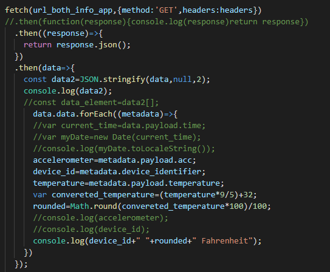

## User/Admin/Anonymous Story

### Product Summary
By using BLE beacons that connect via LTE, we will place them inside trucks that transport perishable items that must remain inside certain temperature ranges. We can use these beacons to track data such as temperature, acceleration of the truck, and GPS location of the truck. This comes to use for logistical tracking to know when trucks arrive and leave certain locations by using GPS and beacons when trucks arrive in range of destinations.

### User Story
* Users of the web application include logistical tracking company employees, grocery store owners, distribution center employees
* We do NOT allow users to view the "Beacons" screen since this is where we can add the beacons they have purchased into their organization dashboard
* Once users sign in they can view the following dashboard items
    * Map
    * Notifications
    * Settings

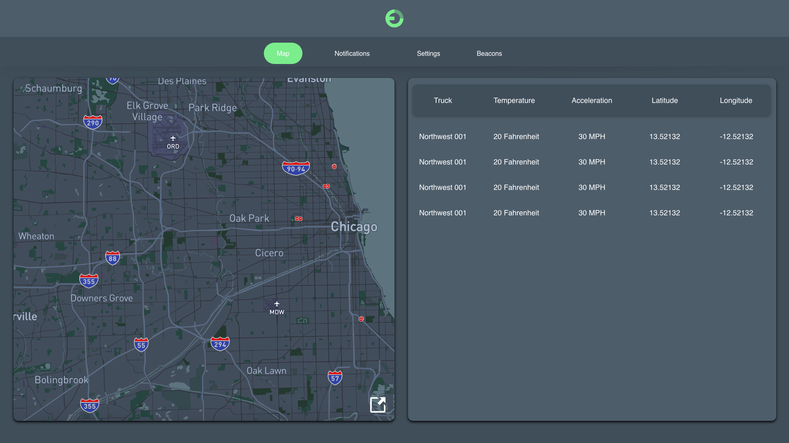
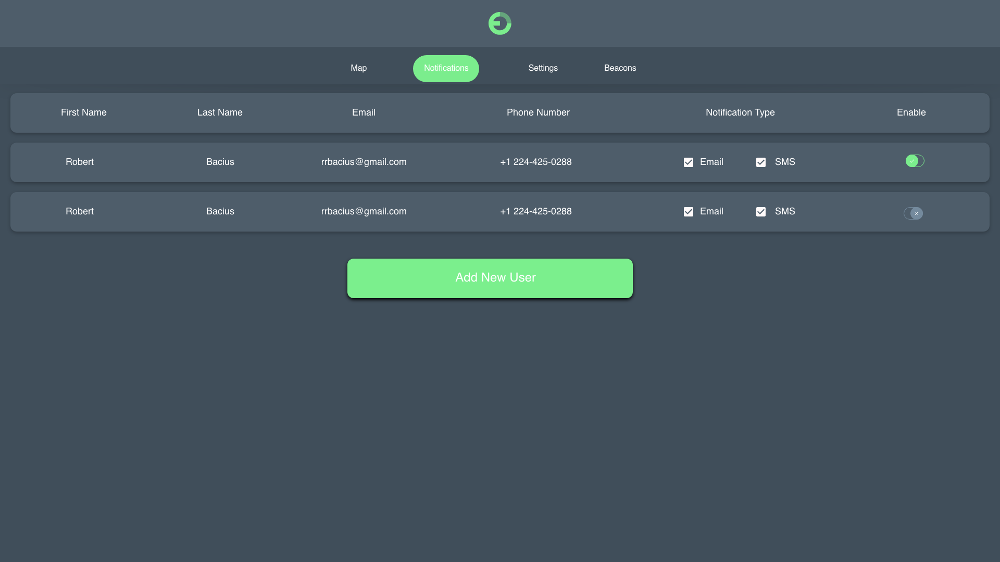
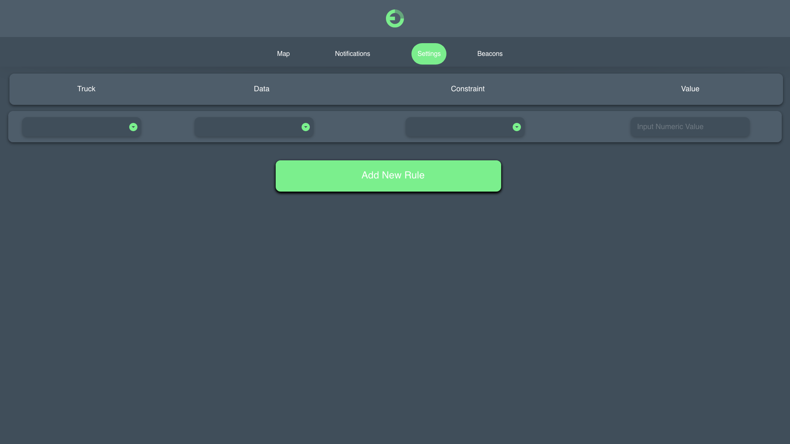

### Admin Story
* The ONLY admins are internal employees who add beacons after purchase of the web application fees and beacon costs
* Once admins sign in they can view the following dashboard items
    * Map
    * Notifications
    * Settings
    * Beacons
        * This is where we can add their organization beacons via beacon ID to link such to their account for tracking purposes

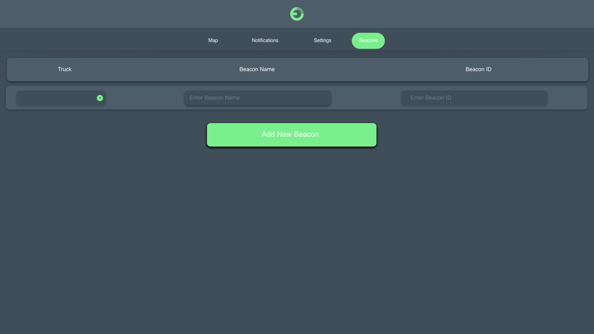

### Anonymous Story
* Users MUST have an account to use our SaaS Product

## Database Schema

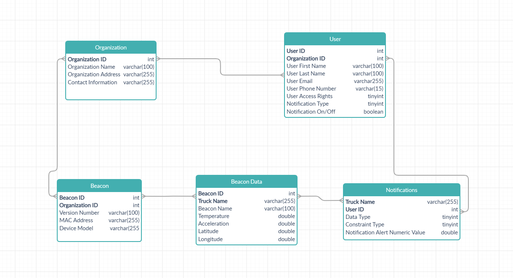
