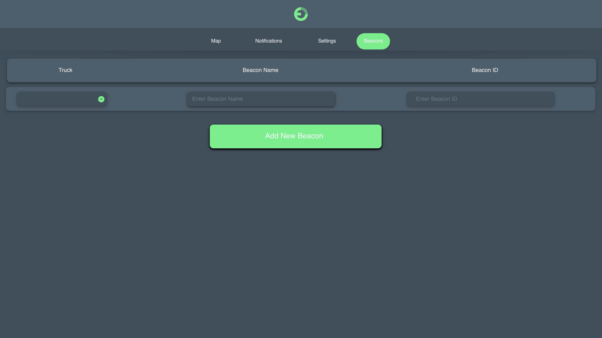

## User/Admin/Anonymous Story

### Product Summary
By using BLE beacons that connect via LTE, we will place them inside trucks that transport perishable items that must remain inside certain temperature ranges. We can use these beacons to track data such as temperature, acceleration of the truck, and GPS location of the truck. This comes to use for logistical tracking to know when trucks arrive and leave certain locations by using GPS and beacons when trucks arrive in range of destinations.

### User Story
* Users of the web application include logistical tracking company employees, grocery store owners, distribution center employees
* We do NOT allow users to view the "Beacons" screen since this is where we can add the beacons they have purchased into their organization dashboard
* Once users sign in they can view the following dashboard items
    * Map
    * Notifications
    * Settings

### Admin Story
* The ONLY admins are internal employees who add beacons after purchase of the web application fees and beacon costs
* Once admins sign in they can view the following dashboard items
    * Map
    * Notifications
    * Settings
    * Beacons
        * This is where we can add their organization beacons via beacon ID to link such to their account for tracking purposes

### Anonymous Story
* Users MUST have an account to use our SaaS Product