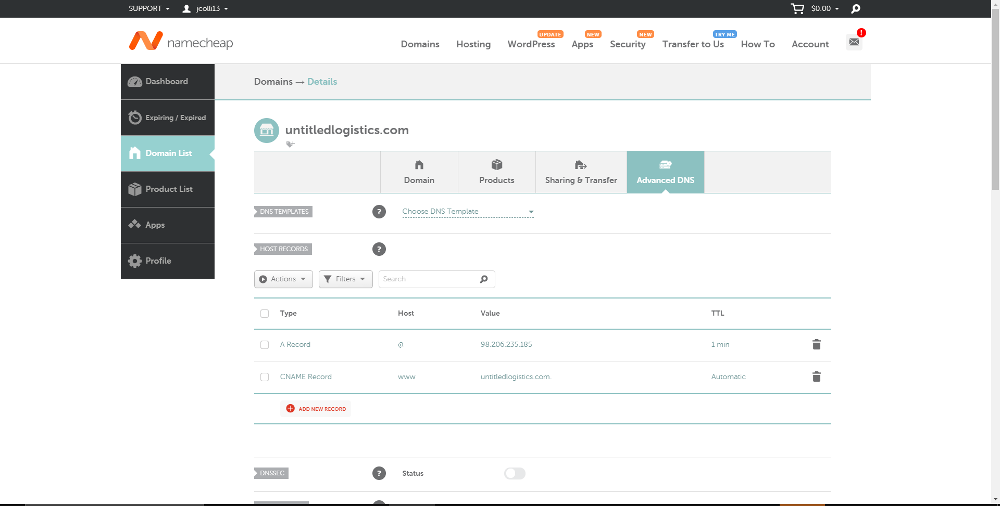
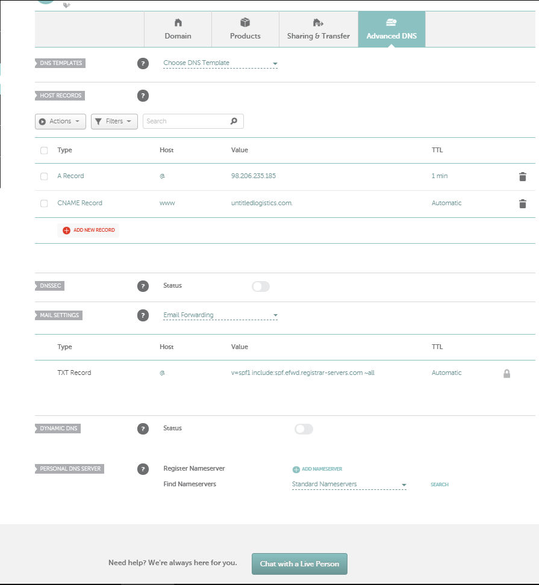

# Sprint-03 Report

## Team Number 04

* Andy Kukuc, Project Manager
* Geldi Omeri, Infrastructure and IT
* Robert Bacius, UI/UX Designer
* Jacob Krupa, Developer
* John Collins, Jr. Developer

## Project Manager Report

* IT Infrastructure 
    * Develop Account Page with Username Change Form - Completed
        * https://github.com/illinoistech-itm/2020-team04r/commit/31546b960a19a8fefaaa0fe51fa1ee5d83d03dbe
        * https://trello.com/c/THsAVgwV/57-develop-account-page-with-username-change-form
    * Setup Username Change Feature Functionality - Completed
        * https://github.com/illinoistech-itm/2020-team04r/commit/e989fd55a6003faa0fb8463e4e625f3f1e67c244
        * https://trello.com/c/42th3Q3I/55-setup-username-change-feature
    * Setup Logout Functionality - Completed
        * https://github.com/illinoistech-itm/2020-team04r/commit/42bafb4f38103db70fb53c221475cb2b1d55e1e8
        * https://trello.com/c/H76gSaBV/58-setup-logout-functionality
    * Get user logins/logouts working on front-end/back-end - Completed
        * https://github.com/illinoistech-itm/2020-team04r/commit/28eadec5f4823aa701675adebd066e5a134e7d83 
        * https://trello.com/c/BhA4IqOU/53-get-user-logons-logouts-working-on-front-end-backend
    * Get admin logins/logouts working on front-end/back-end - Completed 
        * https://github.com/illinoistech-itm/2020-team04r/commit/c45dd58307058795c68a22151b1e2bdc9397504c 
        * https://trello.com/c/cBTN9Wzu/52-get-admin-logons-logouts-working-on-the-front-end

* UI/UX
    * Add all dashboard item views pertaining to admins added into a directory folder. - Completed
        * https://github.com/illinoistech-itm/2020-team04r/commit/0bfd7df3f72998416e6b86a60a255337986dc3d8
    * Add all dashboard item views pertaining to standard users added into a directory folder. - Completed
        * https://github.com/illinoistech-itm/2020-team04r/commit/c28e30491514f6a1a62fa7283cabd3c1cebd498f
    * Add all CSS files to style web page according to finished screen designs. - Completed
        * https://github.com/illinoistech-itm/2020-team04r/commit/ff8250eb8dc2c121d6ca0e523435f7948177ea35
    * Accomplish redirect from Login screen to Map screen successfully based on user email/password. - Completed
        * https://github.com/illinoistech-itm/2020-team04r/commit/749c409ba28f894b6c4a86759e15f4ca5eb61d77
    * Get GPS working on the beacon firmware app to then send to Map Box for truck location visuals. - Completed
        * https://github.com/illinoistech-itm/2020-team04r/commit/18eefbca5c0dd85d2d7f5ffc556d46ad63647b0c
    * [User Story](../../diagrams/sprint03-userstories/user-story.md)
    * [Admin Story](../../diagrams/sprint03-userstories/admin-story.md)

* Developer
    * Get user logins/logouts working on front-end/back-end - Completed
        * https://github.com/illinoistech-itm/2020-team04r/commit/28eadec5f4823aa701675adebd066e5a134e7d83
        * https://trello.com/c/BhA4IqOU/53-get-user-logons-logouts-working-on-front-end-backend
    * Get admin logins/logouts working on front-end/back-end - Completed
        * https://github.com/illinoistech-itm/2020-team04r/commit/c45dd58307058795c68a22151b1e2bdc9397504c
        * https://trello.com/c/cBTN9Wzu/52-get-admin-logons-logouts-working-on-the-front-end
    * Set up a method to create user and admin accounts - Completed
        * https://github.com/illinoistech-itm/2020-team04r/commit/37c5ba410f0e57bac98b6db2fde230c45fed86b6
        * https://trello.com/c/BnkbqK2G/51-set-up-method-to-create-user-and-admin-accounts
    * Set up database to contain at least 15 test users and test data - Completed
        * https://github.com/illinoistech-itm/2020-team04r/commit/d4ea569bdedb04742ffac3633abe9d9315e8e73a
        * https://trello.com/c/GwDobnfH/49-set-up-database-to-contain-at-least-15-test-users-and-test-data
    * Configure front-end to connect to back-end on vagrant/packer - Completed
        * https://github.com/illinoistech-itm/2020-team04r/commit/1eacd35f340720c08ec3199266905ee0d8fc74c1
        * https://trello.com/c/tRVUjEpI/54-configure-front-end-to-connect-to-back-end-on-vagrant-packer

* Junior Developer
    * Get a domain registered for the local server - Completed
	       
    * Point the domain to the server itself - Completed
	       
    * Bug 1: Map Location Icon Not Centered
        * https://iltechsat.atlassian.net/secure/RapidBoard.jspa?rapidView=9&projectKey=TEAM04&modal=detail&selectedIssue=TEAM04-3
    * Bug 2: Notification Page CSS Fixes
        * https://iltechsat.atlassian.net/secure/RapidBoard.jspa?rapidView=9&projectKey=TEAM04&modal=detail&selectedIssue=TEAM04-4
    * Bug 3: Add Notification Data Types
        * https://iltechsat.atlassian.net/secure/RapidBoard.jspa?rapidView=9&projectKey=TEAM04&modal=detail&selectedIssue=TEAM04-5
    * Bug 4: Remove Fields (Account Screen)
        * https://iltechsat.atlassian.net/secure/RapidBoard.jspa?rapidView=9&projectKey=TEAM04&modal=detail&selectedIssue=TEAM04-6
    * Bug 5: Clicking Menu Items Issue
        * https://iltechsat.atlassian.net/secure/RapidBoard.jspa?rapidView=9&projectKey=TEAM04&modal=detail&selectedIssue=TEAM04-7

* Project Manager
    * User Stories
        * [User Story](../../diagrams/sprint03-userstories/user-story.md)
        * [Admin Story](../../diagrams/sprint03-userstories/admin-story.md)
    * Link to Install.md
        * [Install.md](../../install.md)
    * Goals met for Sprint 3
	    * User login and log outs have been tested and approved.
        * Admin login and log outs have been tested and approved.
        * PHP server fully built and running.
        * Vagrant and Packer scripts built, tested, and all running.
        * MySQL server installed and fully functional.
        * Database built on MySQL and hashing passwords.
        * Create new accounts and save them to the database. 
        * Fully built ISO to work on each team members computer.
    * Goals for Sprint 4
        * GPS to send via LTE Beacon current micro-app
        * GPS retrieved from Estimote API
        * GPS displayed through MapBox
        * Bluetooth beacon communication with LTE beacon via micro-app
        * Tell the LTE beacon what pallet of food the beacon is related to
        * Bluetooth beacons added into the database 
