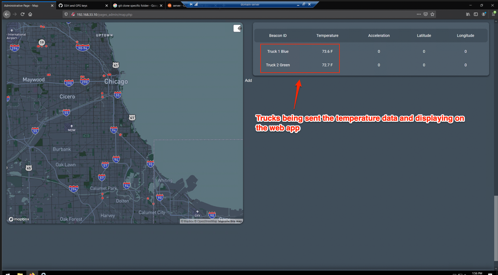
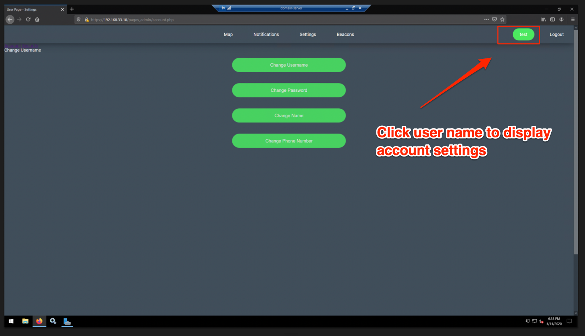
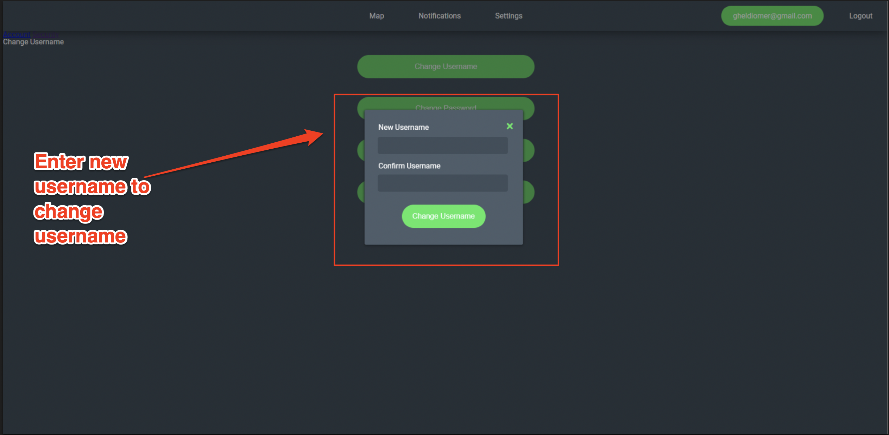
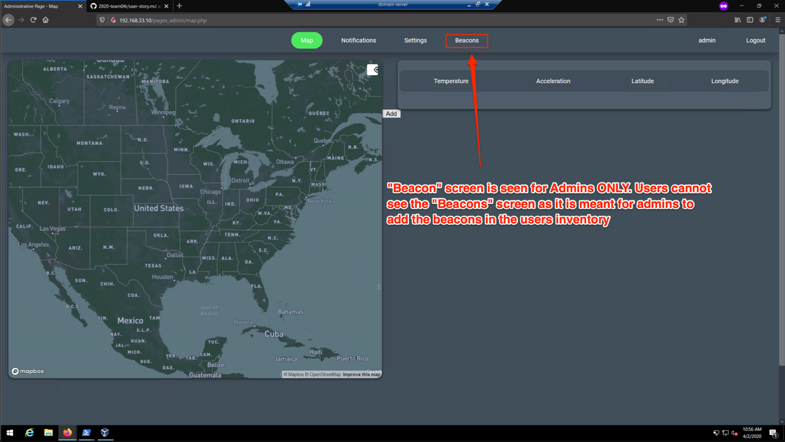
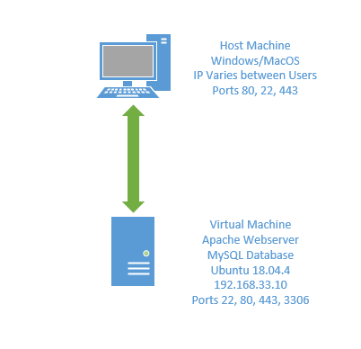

# Sprint-04 Report

## Team Number 04

* Andy Kukuc, Developer
* Geldi Omeri, Project Manager
* Robert Bacius, UI/UX Designer
* Jacob Krupa, Infrastructure and IT
* John Collins, Jr. Developer

## Project Manager Report

* UI/UX 
    * Truck icon added to team repo to display on the map  -completed
        * https://github.com/illinoistech-itm/2020-team04r/commit/81ce0d8c78d9094d3f8eba03416860d7b9ef56a0
        * https://trello.com/c/XRXkJZ31/67-add-truck-icon-to-dispaly-on-map
    * Temperature data displaying on the “Map” screen  -completed
        * https://trello.com/c/XHamcIJD/68-display-tempature-on-map-screen
        * https://github.com/illinoistech-itm/2020-team04r/commit/6e41b8cbc8b86fd0038eb5f8f25707e72bbe4be8
    * Truck Markers Displaying on Map  -completed
        * https://github.com/illinoistech-itm/2020-team04r/commit/0e42a01dde478e7473005e4d8b6b795f704cedba
        * https://trello.com/c/K6H0gx1y/75-truck-markers-display-on-map
    * Added CSS to inputs  -completed
        * https://github.com/illinoistech-itm/2020-team04r/commit/a10d09b58496be7276276b39b29823afbc95b246
        * https://trello.com/c/UI5h0gsw/76-added-css-to-inputs
    * [User Story](../../diagrams/sprint03-userstories/user-story.md)
        * Map page displays temperature data on the table
        
        * Users are able to click on their name to access account settings and then click one of the options displayed to modify their username, password, name, or number
        
        
    * [Admin Story](../../diagrams/sprint03-userstories/admin-story.md)
        * Beacon screen is only visible by Admins
        

* IT Infrastructure 
    * Get user/admin change password button working on front-end/back-end  -completed
        * https://github.com/illinoistech-itm/2020-team04r/commit/d8ce42461a62c797aadaf50a5d7b5312347b5621
        * https://trello.com/c/eZb4o0Dr/69-get-user-admin-change-password-button-working-on-front-end-back-end
    * Get user/admin change name button working on front-end/back-end  -completed
        * https://github.com/illinoistech-itm/2020-team04r/commit/f3ecbb728e5518c4f08887a008388a670ee98d31
        * https://trello.com/c/BejyJXfz/70-get-user-admin-change-name-button-working-on-front-end-back-end
    * Get user/admin change phone number button working on front-end/back-end  -completed
        * https://github.com/illinoistech-itm/2020-team04r/commit/67bff301ae14e9f205c8f34b2e767ae32dc7b977
        * https://trello.com/c/IqAVOHIw/71-get-user-admin-change-phone-number-button-working-on-front-end-back-end
    * Create and push a diagram of all of the discrete servers and their IP addresses in your application  -completed
        * https://github.com/illinoistech-itm/2020-team04r/commit/9bd35aaac482044afecf17029a035a44dc8a14ca
        * https://trello.com/c/OizM3GNB/74-create-and-push-a-diagram-of-all-of-the-discrete-servers-and-their-ip-addresses-in-your-application
    * Create and push a script that will build each of these discrete systems as virtual machines automatically, include instructions how to do this in the install.md located in the root directory  -completed
        * https://github.com/illinoistech-itm/2020-team04r/commit/36594d5138f2afe3ae8283f207554bb3596dc073
        * https://trello.com/c/sQmENko1/72-create-and-push-a-script-that-will-build-each-of-these-discrete-systems-as-virtual-machines-automatically-include-instructions-h
    * Create and push a list of external packages being installed for this application via package manager  -completed
        * https://github.com/illinoistech-itm/2020-team04r/commit/c5bd8808c48c6ebb5dd86baf1be7d8d7a940f8b5
        * https://trello.com/c/W3yGrI3a/73-create-and-push-a-list-of-external-packages-being-installed-for-this-application-via-package-manager
    * Infrastructure Diagram
            
    * Script that builds virtual machine systems
        ```JSON
         {
                "builders": [
                {
                    "name": "ubuntu-vanilla-18043-server-multi-disk",
                    "vm_name": "ubuntu-vanilla-18043-server-multi-disk",
                    "type": "virtualbox-iso",
                    "boot_command": [
                    "<esc><wait>",
                    "<esc><wait>",
                    "<enter><wait>",
                    "/install/vmlinuz<wait>",
                    " auto<wait>",
                    " console-setup/ask_detect=false<wait>",
                    " console-setup/layoutcode=us<wait>",
                    " console-setup/modelcode=pc105<wait>",
                    " debconf/frontend=noninteractive<wait>",
                    " debian-installer=en_US<wait>",
                    " fb=false<wait>",
                    " initrd=/install/initrd.gz<wait>",
                    " kbd-chooser/method=us<wait>",
                    " keyboard-configuration/layout=USA<wait>",
                    " keyboard-configuration/variant=USA<wait>",
                    " locale=en_US<wait>",
                    " netcfg/get_domain=vm<wait>",
                    " netcfg/get_hostname=vagrant<wait>",
                    " grub-installer/bootdev=/dev/sda<wait>",
                    " noapic<wait>",
                    " preseed/url=http://{{ .HTTPIP }}:{{ .HTTPPort }}/preseed/preseed-multi-drives.cfg<wait>",
                    " -- <wait>",
                    "<enter><wait>"
                    ],
                    "boot_wait": "10s",
                    "disk_size": 20000,
                    "guest_os_type": "Ubuntu_64",
                    "http_directory" : ".",
                    "http_port_min" : 9001,
                    "http_port_max" : 9001,
                    "iso_urls": [
                    "http://cdimage.ubuntu.com/ubuntu/releases/bionic/release/ubuntu-18.04.4-server-amd64.iso"
                    ],
                    "iso_checksum_type": "sha256",
                    "iso_checksum": "e2ecdace33c939527cbc9e8d23576381c493b071107207d2040af72595f8990b",
                    "ssh_username": "vagrant",
                    "ssh_password": "vagrant",
                    "ssh_port": 22,
                    "ssh_wait_timeout": "10000s",
                    "shutdown_command": "echo 'vagrant'|sudo -S shutdown -P now",
                    "hard_drive_interface": "sata",
                    "guest_additions_mode": "disable",
                    "guest_additions_path": "VBoxGuestAdditions_{{.Version}}.iso",
                    "virtualbox_version_file": ".vbox_version",
                    "vboxmanage": [
                    [
                        "modifyvm", "{{.Name}}", "--memory", "2048"
                    ],

                    ["createhd", "--filename", "output-virtualbox/packer-virtualbox-disk2.vdi", "--size", "15000", "--format", "VDI", "--variant", "Standard"],
                    ["storageattach", "{{.Name}}", "--storagectl", "IDE Controller", "--port", "1", "--device", "0", "--type", "hdd", "--medium", "output-virtualbox/packer-virtualbox-disk2.vdi"]
                    ]
                    }],
                    
                "provisioners": [
                {
                "type": "shell",
                "execute_command" : "echo 'vagrant' | {{ .Vars }} sudo -E -S sh '{{ .Path }}'",
                "script": "../scripts/post_install_vagrant.sh",
                "environment_vars": [
                    "DBPASS={{user `database-root-password`}}",
                    "USERPASS={{user `database-user-password`}}",
                    "ACCESSFROMIP={{user `database-access-from-ip`}}",
                    "DATABASEIP={{user `database-ip`}}",
                    "DATABASENAME={{user `database-name`}}",
                    "DATABASEUSERNAME={{user `database-user-name`}}"
                ]
                }
                ],
                "post-processors": [
                {
                "type": "vagrant",
                "keep_input_artifact": false,
                "output": "../build/{{.BuildName}}-{{.Provider}}-{{timestamp}}.box"  
                }
                ]
                }
        ```
        
    * External Packages
        * firewalld
        * mysql-server
        * php
        * php-mysql
        * git
        * apache2

* Developer
    * Design custom PHP fetch api to pull data from cloud -completed
        * https://github.com/illinoistech-itm/2020-team04r/commit/25748029ec0882dffa9c9702fa0167f6699a4b1f
        * https://trello.com/c/ni4tYlf0/77-design-custom-php-fetch-api-to-pull-data-from-cloud
    * Design algorithm to parse array and pull back only the latest data -completed
        * https://github.com/illinoistech-itm/2020-team04r/commit/6e41b8cbc8b86fd0038eb5f8f25707e72bbe4be8#diff-6f8c854e2e5b3243af5d896397fe72cc
        * https://trello.com/c/Y8HBcJTk/78-design-algorithm-to-parse-array-and-pull-back-only-the-latest-data
    * Display live data on the  map.php using php -completed
        * https://github.com/illinoistech-itm/2020-team04r/commit/1d75b75a68eb4f08808870523e108a5a30b8ecff#diff-bd6ebbcc516a74d73b92c370ecc743b6
        * https://trello.com/c/6X4GGYqc/79-display-live-data-on-the-mapphp-using-php
    * Generate custom SSL certificates for apache2 -completed
        * https://github.com/illinoistech-itm/2020-team04r/commit/faed74a964712c98b3e74c05408852fc70fddace#diff-2bec14cf5d855a648f6d05666193a16c
        * https://trello.com/c/7sfoBWh6/80-generate-custom-ssl-certificates-for-apache2
    * Redirect all http traffic to https -completed
        * https://github.com/illinoistech-itm/2020-team04r/commit/adfb9d6e3c978551e7807b02de5866f38a9aea30
        * https://trello.com/c/uBG7oF4V/81-redirect-all-http-traffic-to-https
    * Infrastructure Scripts
        ```Sh
            #!/bin/bash 
            set -e
            set -v

            # http://superuser.com/questions/196848/how-do-i-create-an-administrator-user-on-ubuntu
            # http://unix.stackexchange.com/questions/1416/redirecting-stdout-to-a-file-you-dont-have-write-permission-on
            # This line assumes the user you created in the preseed directory is vagrant
            echo "%admin  ALL=NOPASSWD: ALL" | sudo tee -a /etc/sudoers.d/init-users
            sudo groupadd admin
            sudo usermod -a -G admin vagrant

            # Installing vagrant keys
            wget --no-check-certificate 'https://raw.github.com/mitchellh/vagrant/master/keys/vagrant.pub'
            sudo mkdir -p /home/vagrant/.ssh
            sudo chown -R vagrant:vagrant /home/vagrant/.ssh
            cat ./vagrant.pub >> /home/vagrant/.ssh/authorized_keys
            sudo chown -R vagrant:vagrant /home/vagrant/.ssh/authorized_keys
            echo "All Done!"

            ##################################################
            # Add User customizations below here
            ##################################################

            sudo apt-get update -y

            export DEBIAN_FRONTEND=noninteractive
            FIRSTPASS="mariadb-server mysql-server/root_password password $DBPASS"
            SECONDPASS="mariadb-server mysql-server/root_password_again password $DBPASS"
            echo $FIRSTPASS | sudo debconf-set-selections
            echo $SECONDPASS | sudo debconf-set-selections

            #echo "192.168.33.10 dbhost.example.com dbhost" | sudo tee -a /etc/hosts
            #echo "192.168.33.11 webhost.example.com webhost" | sudo tee -a /etc/hosts

            sudo apt-get install -y firewalld
            sudo systemctl enable firewalld

            sudo firewall-cmd --permanent --add-rich-rule='rule family="ipv4" source address="127.0.0.1" port protocol="tcp" port="3306" accept'
            sudo firewall-cmd --permanent --add-service=ssh
            sudo firewall-cmd --permanent --add-port=22/tcp
            sudo firewall-cmd --permanent --add-port=80/tcp
            sudo firewall-cmd --permanent --add-port=443/tcp
            sudo firewall-cmd --reload

            sudo apt-get install -y mysql-server php php-mysql git apache2

            #sudo sed -i 's/127.0.0.1/0.0.0.0/g' /etc/mysql/mysql.conf.d/mysqld.cnf
            sudo systemctl restart mysql

            git clone https://github.com/jkrupa46/ITMO556.git
            cd ITMO556
            mysql -u root -p$DBPASS < create.sql
            mysql -u root -p$DBPASS < create-user-with-grants.sql
            mysql -u root -p$DBPASS < insert.sql

            #echo "192.168.33.10 dbhost.example.com dbhost" | sudo tee -a /etc/hosts
            #echo "192.168.33.11 webhost.example.com webhost" | sudo tee -a /etc/hosts

            git clone https://github.com/jkrupa46/ITMT_430_TestFiles.git
            sudo mv ITMT_430_TestFiles/* /var/www/html

            sudo systemctl enable apache2
            sudo rm /var/www/html/index.html
            sudo systemctl restart apache2

            sudo openssl req -new -newkey rsa:4096 -x509 -sha256 -days 365 -nodes -out /etc/ssl/certs/MyCertificate.crt -keyout /etc/ssl/private/MyKey.key -subj "/C=US/ST=IL/L=Chicago/O=Untitled Logistics/OU= /CN= "

            sudo touch /etc/apache2/sites-available/untitledlogistics.com.conf

            sudo echo "<VirtualHost 192.168.33.10:80>
            ServerName www.untitledlogistics1.com
            Redirect permanent / https://192.168.33.10
            </VirtualHost>

            <VirtualHost 192.168.33.10:443>
            DocumentRoot /var/www/html/
            SSLEngine On
            SSLCertificateFile /etc/ssl/certs/MyCertificate.crt
            SSLCertificateKeyFile /etc/ssl/private/MyKey.key
            SSLCaCertificateFile /etc/ssl/certs/ca-certificates.crt
            ServerName www.untitledlogistics1.com
            </VirtualHost>" | sudo tee -a /etc/apache2/sites-available/untitledlogistics.com.conf

            cd /etc/apache2/sites-available

            sudo a2enmod ssl

            sudo a2ensite untitledlogistics.com.conf

            sudo systemctl restart apache2
        ```
    
    * SQL Scheme
        * Create User
        ```SQL
            CREATE USER 'testuser'@'127.0.0.1' IDENTIFIED BY 'bar';
            GRANT SELECT,INSERT,UPDATE,DELETE,CREATE,CREATE TEMPORARY TABLES,DROP,INDEX,ALTER ON users.* TO testuser@'127.0.0.1' IDENTIFIED BY 'bar'; 
            FLUSH PRIVILEGES;

            -- My example would be
            -- CREATE USER 'worker'@'192.168.1.239' IDENTIFIED BY 'ilovebunnies';
            -- GRANT ALL ON *.* TO 'worker'@'192.168.1.239';
        ```

        * Create Database
        ```SQL
            CREATE DATABASE IF NOT EXISTS users; 

            USE users;

            CREATE TABLE customer (
            id  INT NOT NULL PRIMARY KEY AUTO_INCREMENT,
            username     VARCHAR(255)    NOT NULL,
            create_date   DATETIME    NOT NULL,
            password      VARCHAR(255)   NOT NULL,
            last_name     VARCHAR(255),
            first_name    VARCHAR(255),
            phone         VARCHAR(25)
            );
        ```
        
        * Insert Users
        ```SQL
            Use users;

            INSERT INTO customer (id, username, create_date, password, last_name, first_name, phone) Values (0, "joedoe@gmail.com", CURRENT_TIMESTAMP, "098f6bcd4621d373cade4e832627b4f6", "Doe", "Joe", "708-708-7080");
            INSERT INTO customer (id, username, create_date, password, last_name, first_name, phone) Values (0, "janedoe@gmail.com", CURRENT_TIMESTAMP, "098f6bcd4621d373cade4e832627b4f6", "Doe", "Jane", "708-700-7000");
            INSERT INTO customer (id, username, create_date, password, last_name, first_name, phone) Values (0, "gheldiomer@gmail.com", CURRENT_TIMESTAMP, "098f6bcd4621d373cade4e832627b4f6", "Omer", "Gheldi", "708-711-7111");
            INSERT INTO customer (id, username, create_date, password, last_name, first_name, phone) Values (0, "jakekrup@gmail.com", CURRENT_TIMESTAMP, "098f6bcd4621d373cade4e832627b4f6", "Krup", "Jake", "708-722-7222");
            INSERT INTO customer (id, username, create_date, password, last_name, first_name, phone) Values (0, "adamfrank.com", CURRENT_TIMESTAMP, "098f6bcd4621d373cade4e832627b4f6", "Frank", "Adam", "708-733-7333");
            INSERT INTO customer (id, username, create_date, password, last_name, first_name, phone) Values (0, "janiepowers@gmail.com", CURRENT_TIMESTAMP, "098f6bcd4621d373cade4e832627b4f6", "Powers", "Janie", "708-744-7444");
            INSERT INTO customer (id, username, create_date, password, last_name, first_name, phone) Values (0, "evapratt@gmail.com", CURRENT_TIMESTAMP, "098f6bcd4621d373cade4e832627b4f6", "Pratt", "Eva", "708-755-7555");
            INSERT INTO customer (id, username, create_date, password, last_name, first_name, phone) Values (0, "jakeking@gmail.com", CURRENT_TIMESTAMP, "098f6bcd4621d373cade4e832627b4f6", "King", "Jake", "708-766-7666");
            INSERT INTO customer (id, username, create_date, password, last_name, first_name, phone) Values (0, "timfrank@gmail.com", CURRENT_TIMESTAMP, "098f6bcd4621d373cade4e832627b4f6", "Frank", "Tim", "708-777-7777");
            INSERT INTO customer (id, username, create_date, password, last_name, first_name, phone) Values (0, "brandyhale@gmail.com", CURRENT_TIMESTAMP, "098f6bcd4621d373cade4e832627b4f6", "Brandy", "Hale", "708-788-7888");
            INSERT INTO customer (id, username, create_date, password, last_name, first_name, phone) Values (0, "danieloscar@gmail.com", CURRENT_TIMESTAMP, "098f6bcd4621d373cade4e832627b4f6", "Oscar", "Daniel", "708-799-7999");
            INSERT INTO customer (id, username, create_date, password, last_name, first_name, phone) Values (0, "dorisgraves@gmail.com", CURRENT_TIMESTAMP, "098f6bcd4621d373cade4e832627b4f6", "Graves", "Doris", "708-800-8000");
            INSERT INTO customer (id, username, create_date, password, last_name, first_name, phone) Values (0, "louisblake@gmail.com", CURRENT_TIMESTAMP, "098f6bcd4621d373cade4e832627b4f6", "Blake", "Louis", "708-811-8111");
            INSERT INTO customer (id, username, create_date, password, last_name, first_name, phone) Values (0, "joshpratt@gmail.com", CURRENT_TIMESTAMP, "098f6bcd4621d373cade4e832627b4f6", "Pratt", "Josh", "708-822-8222");
            INSERT INTO customer (id, username, create_date, password, last_name, first_name, phone) Values (0, "carriewebb@gmail.com", CURRENT_TIMESTAMP, "098f6bcd4621d373cade4e832627b4f6", "Webb", "Carrie", "708-833-8333");
        ```

* Junior Developer
    * Added ARIA labels to Settings page for screenreader accessibility
        * https://github.com/illinoistech-itm/2020-team04r/commit/e64f204af4ea33346297a224e26259555254a77c
        * https://trello.com/c/4wueLaY5/82-add-accessible-aria-labels-to-form-elements-for-screen-reader-support
    * Added ARIA labels to Notifications page for accessibility
        * https://github.com/illinoistech-itm/2020-team04r/commit/88c88b952ee6904a236f0a4e7eacc046a2e9cd3e
        * https://trello.com/c/wnkyjFOa/83-added-aria-labels-to-notifications-page-for-accessibility

    * Issues & Bugs:
        * Accessibility: Form elements on Settings page do not have accessible labels 
            * https://github.com/illinoistech-itm/2020-team04r/issues/9#issue-600555344
        * Accessibility: Form elements on notifications page do not have accessible labels 
            * https://github.com/illinoistech-itm/2020-team04r/issues/8#issue-600553157
        * Accessibility: "Add" button on map page is not keyboard focusable
            * https://github.com/illinoistech-itm/2020-team04r/issues/7#issue-600551592
        * Page footer is not snapping to the bottom of the window
            * https://github.com/illinoistech-itm/2020-team04r/issues/6#issue-600548152
        * trimming on map location button misaligned
            * https://github.com/illinoistech-itm/2020-team04r/issues/5#issue-600545634
        * Contact details not saved on notifications screen
            * https://github.com/illinoistech-itm/2020-team04r/issues/4#issue-600544431
        * Values not saved on settings screen
            * https://github.com/illinoistech-itm/2020-team04r/issues/3#issue-600543272
        * letter e can be inputted into the value field on the settings page
            * https://github.com/illinoistech-itm/2020-team04r/issues/2#issue-600542100


* Project Manager
    * Link to Install.md
        * [Install.md](../../install.md)
    * Assumptions
        * Our discrete systems are all on one server for simplicities sake.