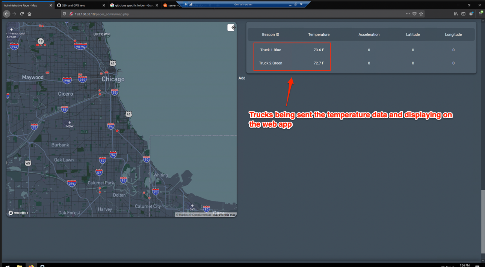
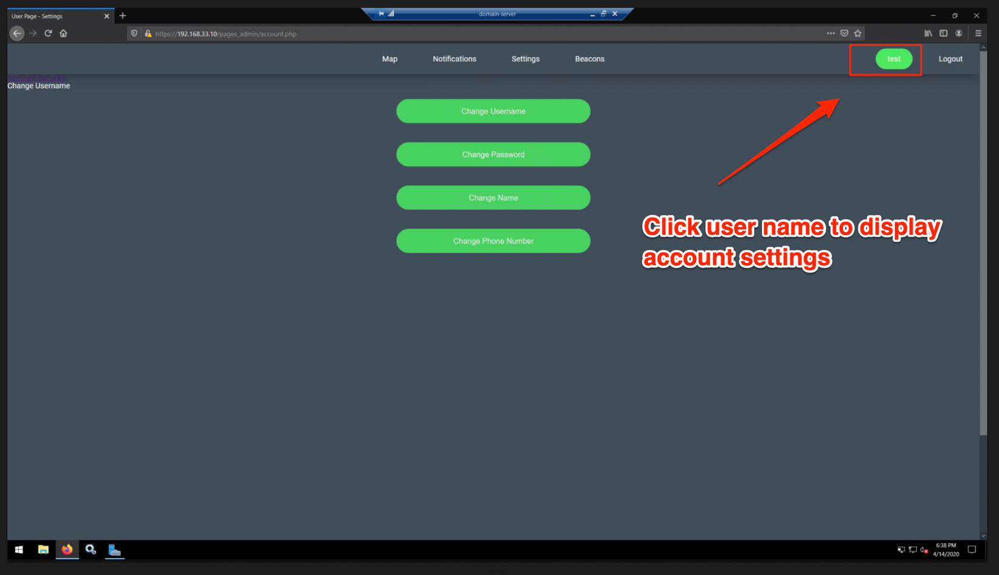
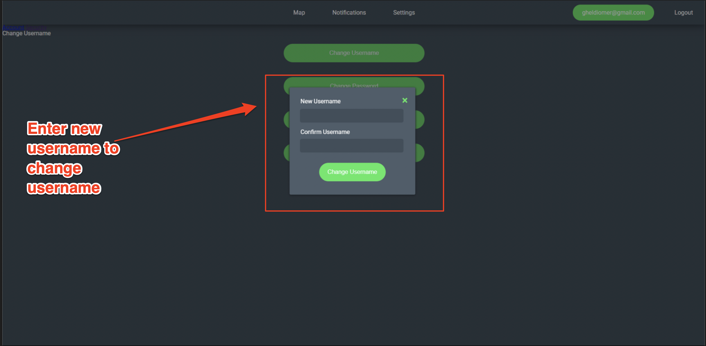
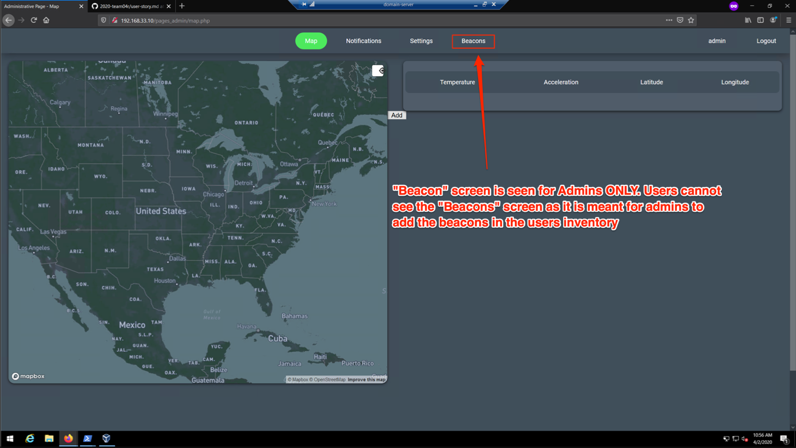

# Sprint-05 Report

## Team Number 04

* Andy Kukuc, Developer
* Geldi Omeri, Project Manager
* Robert Bacius, UI/UX Designer
* Jacob Krupa, Infrastructure and IT
* John Collins, Jr. Developer

## Project Manager Report

* UI/UX 

    * [User Story](../../diagrams/sprint03-userstories/user-story.md)
        * Map page displays temperature data on the table
        
        * Users are able to click on their name to access account settings and then click one of the options displayed to modify their username, password, name, or number
        
        
    * [Admin Story](../../diagrams/sprint03-userstories/admin-story.md)
        * Beacon screen is only visible by Admins
        
        
* IT Infrastructure 

* Developer

* Junior Developer

* Project Manager
    * Final product accomplishments
        *
    * Follow the link to set up Vagrant/Packer and Estimote LTE Beacon Development Environment (Estimote login will be given upon request): [install.md](https://github.com/illinoistech-itm/2020-team04r/blob/master/install.md) 