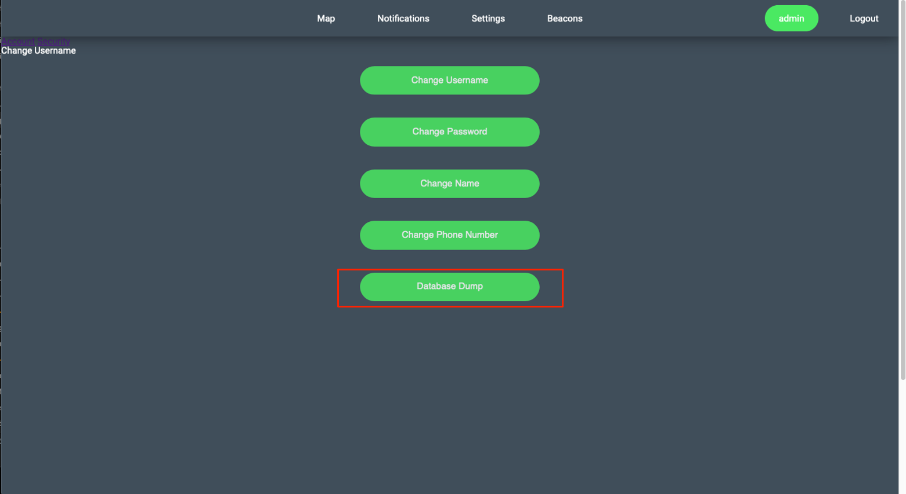
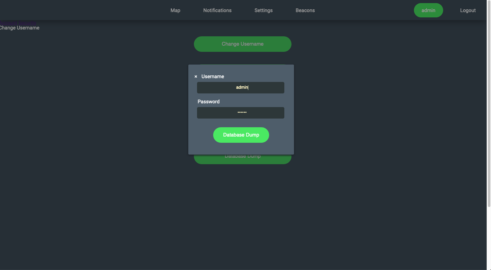
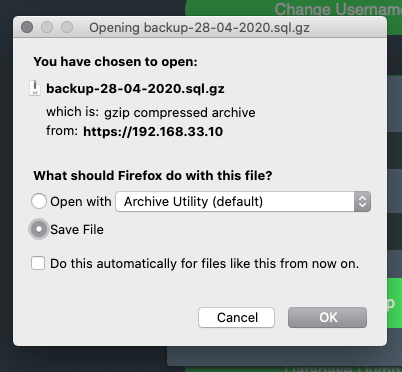
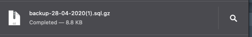

# Sprint-05 Report

## Team Number 04

* Andy Kukuc, Developer
* Geldi Omeri, Project Manager
* Robert Bacius, UI/UX Designer
* Jacob Krupa, Infrastructure and IT
* John Collins, Jr. Developer

## Project Manager Report

* UI/UX 
    * [User Story](../../diagrams/sprint03-userstories/user-story.md)
        * Map page displays temperature data on the table
        
        * Users are able to click on their name to access account settings and then click one of the options displayed to modify their username, password, name, or number
        
        
        * Beacon screen is only visible by Admins
        
    * Truck icon added with attached Latitude & Longitude coordinates
        * https://trello.com/c/AZCeaKvM/86-add-truck-ui-with-lat-long
    * Add beacon dropdown list for "Beacons" page
        * https://github.com/illinoistech-itm/2020-team04r/commit/9ce247f8b065f8202263d90c6a0c5fe08319be83
    * Add front end ability for data dump
       * https://github.com/illinoistech-itm/2020-team04r/commit/6830b71ee35f2cda61bef94eb4fb453ff38c64aa
       
            * Select Data Dump "Admin Username > Data Dump"
        
        
            * Confirm login
        
        
            * Select file download
        
        
            * Successful data dump file download
        
    * Fixed footer issue. Footer is now sticky at the bottom of the page
        * https://github.com/illinoistech-itm/2020-team04r/issues/6
     * Fix map realignment
        * https://github.com/illinoistech-itm/2020-team04r/issues/5
     * Save data on "Map" data table
        * https://github.com/illinoistech-itm/2020-team04r/issues/3
     * Hide password inputs on Change Password screen
        * https://github.com/illinoistech-itm/2020-team04r/issues/1
     * Accept letter "e" to settings fields
        * https://github.com/illinoistech-itm/2020-team04r/issues/2
        
* IT Infrastructure 
    * Add database encryption to mySQL server
        * https://github.com/illinoistech-itm/2020-team04r/commit/3985d7e8233db33040045746302ad1edb9177ad1
        
    * Push final fixes for vagrant/packer. Operational on all team members devices
        * https://github.com/illinoistech-itm/2020-team04r/commit/9dfd50ffb8d3d734960bf2f47462b74ff73a13bb
    * All build instructions added to our [install.md](https://github.com/illinoistech-itm/2020-team04r/blob/master/install.md) file
        * https://trello.com/c/KiyAmwGH/91-create-installmd-file
    * List of packages to be installed
        * [Package List](https://github.com/illinoistech-itm/2020-team04r/blob/master/diagrams/virtual-infastructure/package-list.md) 
     
     

* Developer
    * Merge GPS function with Beacon Info function to complete v1 of beacon firmware
        * https://trello.com/c/VvF3nymx/66-merge-gps-function-with-beacon-info-function
    * Display acceleration on front end map view
        * https://trello.com/c/hs6Mfl7n/87-display-acceleration-on-front-end-map-view
    * Display lat/long on front end map view
        * https://trello.com/c/OKkvZFlh/88-display-lat-long-on-front-end-map-view
    * Display temperature on front end map view
        * https://trello.com/c/iIk0Rprs/89-display-lat-long-on-front-end-map-view
    * Implement database encryption 
        * https://trello.com/c/51F5XG9g/85-db-encryption
    

* Junior Developer
    * Remote push beacon firmware to both LTE beacons (v1 firmware update)
        * https://trello.com/c/77CZgO0B/90-push-beacon-firmware-to-both-lte-beacons
    * Optimize fetch.php for quick delivery time of beacon data
        * https://github.com/illinoistech-itm/2020-team04r/commit/3eabbbb05230924448143918dfaaefe684775553
    * Add firewall ports to show what ports are being communicated with 
        * https://github.com/illinoistech-itm/2020-team04r/commit/0fdec00736fc430ac892ceca126d57ba9d456090
    * Smoke test UAT environment and log outstanding bugs
        * https://github.com/illinoistech-itm/2020-team04r/issues

* Project Manager
    * Final product accomplishments
        * Brainstormed an innovative way to track vital data needed to ensure quality shipments of food items
        * Researched technology to leverage Bluetooth and LTE to develop high level planning of user stories and technology infrastructure
        * Created polished front end screens for ease of use to customers via a user and admin view type
        * Developed firmware for LTE beacons to gather vital truck data such as temperature, acceleration, and location
        * Built a robust back end to fetch and store data needed to accomplish data tracking goals
        * Created an easy to deploy Vagrant/Packer box built for internal testing and development prior to deploying our code to a fully cloud SaaS product
    * Follow the link to set up Vagrant/Packer and Estimote LTE Beacon Development Environment (Estimote login will be given upon request): [install.md](https://github.com/illinoistech-itm/2020-team04r/blob/master/install.md) 